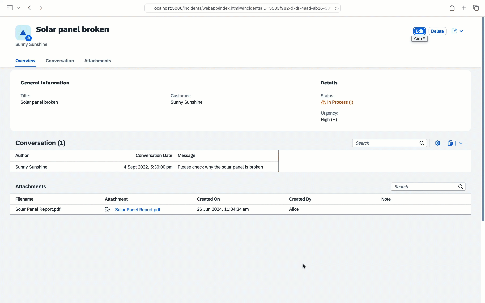

# CAP plugin for SAP Document Management Service

The **@cap-js/sdm** package is [cds-plugin](https://cap.cloud.sap/docs/node.js/cds-plugins#cds-plugin-packages) that provides an easy CAP-level integration with SAP Document Management Service. This package supports handling of attachments(documents) by using an aspect Attachments in SAP Document Management Service.  
This plugin can be consumed by the CAP application deployed on BTP to store their documents in the form of attachments in Document Management Repository.

# Key features

- Create attachment : Provides the capability to upload new attachments.
- Open attachment : Provides the capability to preview attachments.
- Delete attachment : Provides the capability to remove attachments.
- Rename attachment : Provides the capability to rename attachments.
- Virus scanning : Provides the capability to support virus scan for virus scan enabled repositories.
- Draft functionality : Provides the capability of working with draft attachments.

### Table of Contents

- [Pre-Requisites](#pre-requisites)
- [Setup](#setup)
- [Use @cap-js/sdm plugin](#use-cap-jssdm-plugin)
- [Deploying and testing the application](#deploying-and-testing-the-application)
- [Running the unit tests](#running-the-unit-tests)
- [Support, Feedback, Contributing](#support-feedback-contributing)
- [Code of Conduct](#code-of-conduct)
- [Licensing](#licensing)

## Pre-Requisites
* Node.JS 16 or higher
* CAP Development Kit (`npm install -g @sap/cds-dk`)
* SAP Build WorkZone should be subscribed to view the HTML5Applications.
* [MTAR builder](https://www.npmjs.com/package/mbt) (`npm install -g mbt`)
* [Cloud Foundary CLI](https://docs.cloudfoundry.org/cf-cli/install-go-cli.html), Install cf-cli and run command `cf install-plugin multiapps`.

## Setup

In this guide, we use the [Incidents Management reference sample app](https://github.com/cap-js/incidents-app) as the base application, to integrate SDM CAP plugin.

### Using the released version
If you want to use the released version of SDM CAP plugin follow the below steps:

1. Clone the incidents-app repository:

```sh
   git clone https://github.com/cap-js/incidents-app.git
```

2. Navigate to incidents-app root folder and checkout to the branch **incidents-app-deploy**:

```sh
   git checkout incidents-app-deploy
```

3. Install SDM CAP plugin by executing the following command:

```sh
   npm add @cap-js/sdm
```

### Using the development version
If you want to use the version under development follow the below steps:

1. Clone the sdm repository:

```sh
   git clone https://github.com/cap-js/sdm.git
```

2. Open terminal, navigate to sdm root folder and generate tarball:

```sh
   npm pack

   This will generate a file with name cap-js-sdm-x.y.z.tgz
```

3. Clone the incidents-app repository:

```sh
   git clone https://github.com/cap-js/incidents-app.git
```

4. Navigate to incidents-app root folder and checkout to the branch **incidents-app-deploy**:

```sh
   git checkout incidents-app-deploy
```

5. Copy the path of .tgz file generated in step 2 and in terminal navigate to incidents-app root folder and execute:

```sh
   npm install <path-to-.tgz file>
```

## Use @cap-js/sdm plugin

**To use sdm plugin in incidents-app, create an element with an `Attachments` type.** Following the [best practice of separation of concerns](https://cap.cloud.sap/docs/guides/domain-modeling#separation-of-concerns), create a separate file _db/attachments.cds_ and paste the below content in it:

```
using { sap.capire.incidents as my } from './schema';
using { Attachments } from '@cap-js/sdm';

extend my.Incidents with { attachments: Composition of many Attachments }
```

**Create a SAP Document Management Integration Option [Service instance and key](https://help.sap.com/docs/document-management-service/sap-document-management-service/creating-service-instance-and-service-key). For Service instance use the name "sdm-di-instance". Using credentials from key [onboard a repository](https://help.sap.com/docs/document-management-service/sap-document-management-service/onboarding-repository) and configure the onboarded repositoryId under cds.requires in package.json**

```
"sdm": {
   "settings": {
   "repositoryId": "<repository-Id>"
   }
}
```

## Deploying and testing the application

1. Log in to Cloud Foundry space:

   ```sh
   cf login -a <CF-API> -o <ORG-NAME> -s <SPACE-NAME>
   ```

2. Build the project by running following command from root folder of incidents-app.
   ```sh
   mbt build
   ```
   Above step will generate .mtar file inside mta_archives folder.

3. Deploy the application
   ```sh
   cf deploy mta_archives/*.mtar
   ```

4. Launch the application
   ```sh
   * Navigate to Html5Applications menu in BTP subaccount and open the application (nsincidents v1.0.0) in a browser.
   * Click on incident with title Solar panel broken.
   ```  

5. The `Attachments` type has generated an out-of-the-box Attachments table (see 1) at the bottom of the Object page:
   

6. **Upload a file** by going into Edit mode and either using the **Upload** button on the Attachments table or by drag/drop. Then click the **Save** button to have that file stored in SAP Document Management Integration Option. We demonstrate this by uploading the PDF file from [_xmpl/db/content/Solar Panel Report.pdf_](./xmpl/db/content/Solar%20Panel%20Report.pdf):
   

7. **Open a file** by clicking on the attachment. We demonstrate this by opening the previously uploaded PDF file: `Solar Panel Report.pdf`
   

8. **Rename a file** by going into Edit mode and setting a new name for the file in the rename box. Then click the **Save** button to have that file renamed in SAP Document Management Integration Option. We demonstrate this by renaming the previously uploaded PDF file: `Solar Panel Report.pdf`
   

9. **Delete a file** by going into Edit mode and selecting the file(s) and by using the **Delete** button on the Attachments table. Then click the **Save** button to have that file deleted from the resource (SAP Document Management Integration Option). We demonstrate this by deleting the previously uploaded PDF file: `Solar Panel Report_2024.pdf`
   

## Running the unit tests

To run the unit tests:
```sh
npm run test
```


## Support, Feedback, Contributing

This project is open to feature requests/suggestions, bug reports etc. via [GitHub issues](https://github.com/cap-js/sdm/issues). Contribution and feedback are encouraged and always welcome. For more information about how to contribute, the project structure, as well as additional contribution information, see our [Contribution Guidelines](CONTRIBUTING.md).

## Code of Conduct

We as members, contributors, and leaders pledge to make participation in our community a harassment-free experience for everyone. By participating in this project, you agree to abide by its [Code of Conduct](CODE_OF_CONDUCT.md) at all times.

## Licensing

Copyright 2024 SAP SE or an SAP affiliate company and <your-project> contributors. Please see our [LICENSE](LICENSE) for copyright and license information. Detailed information including third-party components and their licensing/copyright information is available [via the REUSE tool](https://api.reuse.software/info/github.com/cap-js/sdm).

