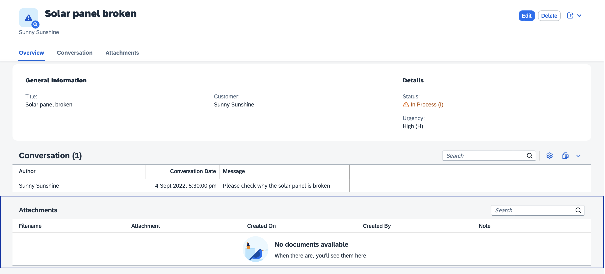
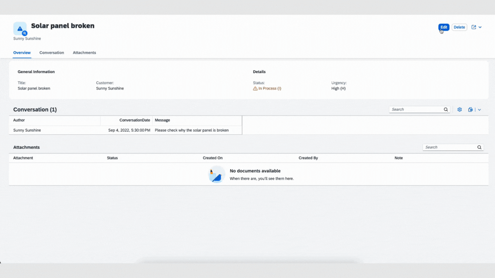
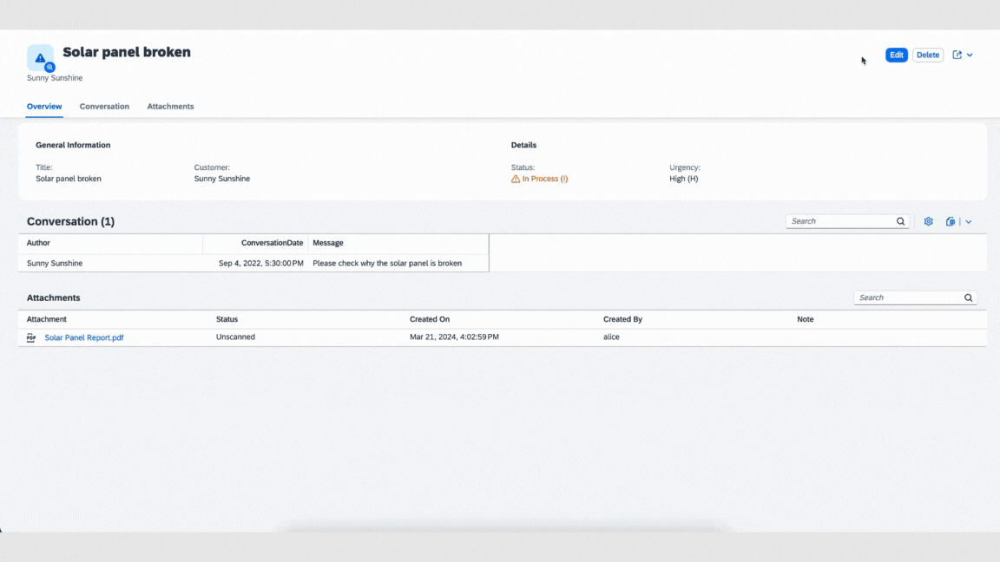

# CAP plugin for SAP Document Management Service

The **@cap-js/sdm** package is [cds-plugin](https://cap.cloud.sap/docs/node.js/cds-plugins#cds-plugin-packages) that provides an easy CAP-level integration with SAP Document Management Service. This package supports handling of attachments(documents) by using an aspect Attachments in SAP Document Management Service.  
This plugin can be consumed by the CAP application deployed on BTP to store their documents in the form of attachments in Document Management Repository.

### Table of Contents

- [Setup](#setup)
- [Use `sdm`](#use-sdm)
- [Testing the application locally](#testing-the-application-locally)
- [Support, Feedback, Contributing](#support-feedback-contributing)
- [Code of Conduct](#code-of-conduct)
- [Licensing](#licensing)

## Setup

In this guide, we use the [Incidents Management reference sample app](https://github.com/cap-js/incidents-app) as the base application, to add `Attachments` type to the CDS model.

> **Note:** This plugin is yet to be released. After the release, to enable SDM, simply add this self-configuring plugin package to your project using the following command:
>
> ```sh
> npm add @cap-js/sdm
> ```

Prior to release follow below steps to enable sdm plugin

1. Clone the incidents-app repository:

```sh
   git clone https://github.com/cap-js/incidents-app.git
```

2. Clone the sdm repository:

```sh
   git clone https://github.com/cap-js/sdm.git
```

3. Open terminal, navigate to sdm root folder and generate tarball:

```sh
   npm pack

   This will generate a file with name cap-js-sdm-1.0.0.tgz
```

4. Copy the path of .tgz file generated in step 3 and in terminal navigate to incidents-app root folder and execute:

```sh
   npm install <path-to-.tgz file>
```

## Use sdm

**To use sdm plugin in incidents-app, create an element with an `Attachments` type.** Following the [best practice of separation of concerns](https://cap.cloud.sap/docs/guides/domain-modeling#separation-of-concerns), create a separate file _db/attachments.cds_ and paste the below content in it:

```
using { sap.capire.incidents as my } from './schema';
using { Attachments } from '@cap-js/sdm';

extend my.Incidents with { attachments: Composition of many Attachments }
```

**Create a SAP Document Management Service instance and key. Using credentials from key [onboard a repository](https://help.sap.com/docs/document-management-service/sap-document-management-service/onboarding-repository) and configure the onboarded repositoryId under cds.requires in package.json**

```
"sdm": {
   "settings": {
   "repositoryId": "<repository-Id>"
   }
}
```

## Testing the application locally

For using SAP Document Management Service to store attachments, use the instance-name and service-key values of SAP Document Management Service Integration Option in the below setup.

1. Install cds-dk globally

   ```sh
   npm i @sap/cds-dk -g
   ```

2. Log in to Cloud Foundry space:

   ```sh
   cf login -a <CF-API> -o <ORG-NAME> -s <SPACE-NAME>
   ```

3. To bind to the service continue with the steps below.

   In the project directory, you can generate a new file \_.cdsrc-private.json by running:

   ```sh
   cds bind sdm -2 <INSTANCE-NAME>:<SERVICE-KEY> --kind sdm
   ```

4. **Start the server**:

- _Default_ scenario (In memory database):
  ```sh
  cds watch --profile hybrid
  ```

5. **Navigate to the object page** of the incident `Solar panel broken`:

   ```sh
   * Open http://localhost:4004 in a browser.
   * If prompted for sign-in, enter alice in username field and click on Sign In button.
   * Click on /incidents/webapp under Web Applications.
   * Click on incident with title Solar panel broken.
   ```

   Or, directly navigate to [Object page for incident **Solar panel broken.**](<http://localhost:4004/incidents/webapp/index.html#/Incidents(ID=3583f982-d7df-4aad-ab26-301d4a157cd7,IsActiveEntity=true)>)

6. The `Attachments` type has generated an out-of-the-box Attachments table (see 1) at the bottom of the Object page:
   

7. **Upload a file** by going into Edit mode and either using the **Upload** button on the Attachments table or by drag/drop. Then click the **Save** button to have that file stored in SAP Document Management Integration Option. We demonstrate this by uploading the PDF file from [_xmpl/db/content/Solar Panel Report.pdf_](./xmpl/db/content/Solar%20Panel%20Report.pdf):
   

8. **Delete a file** by going into Edit mode and selecting the file(s) and by using the **Delete** button on the Attachments table. Then click the **Save** button to have that file deleted from the resource (SAP Document Management Integration Option). We demonstrate this by deleting the previously uploaded PDF file: `Solar Panel Report.pdf`
   

## Support, Feedback, Contributing

This project is open to feature requests/suggestions, bug reports etc. via [GitHub issues](https://github.com/cap-js/sdm/issues). Contribution and feedback are encouraged and always welcome. For more information about how to contribute, the project structure, as well as additional contribution information, see our [Contribution Guidelines](CONTRIBUTING.md).

## Code of Conduct

We as members, contributors, and leaders pledge to make participation in our community a harassment-free experience for everyone. By participating in this project, you agree to abide by its [Code of Conduct](CODE_OF_CONDUCT.md) at all times.

## Licensing

Copyright 2024 SAP SE or an SAP affiliate company and <your-project> contributors. Please see our [LICENSE](LICENSE) for copyright and license information. Detailed information including third-party components and their licensing/copyright information is available [via the REUSE tool](https://api.reuse.software/info/github.com/cap-js/sdm).
