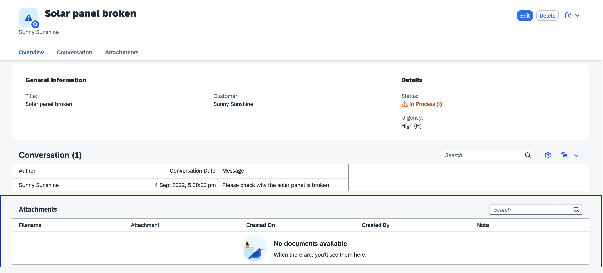
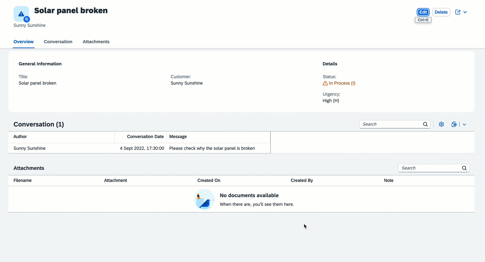
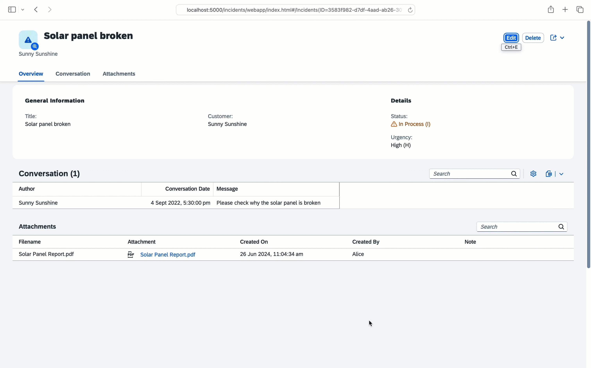
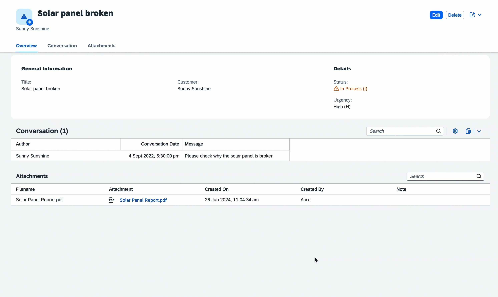
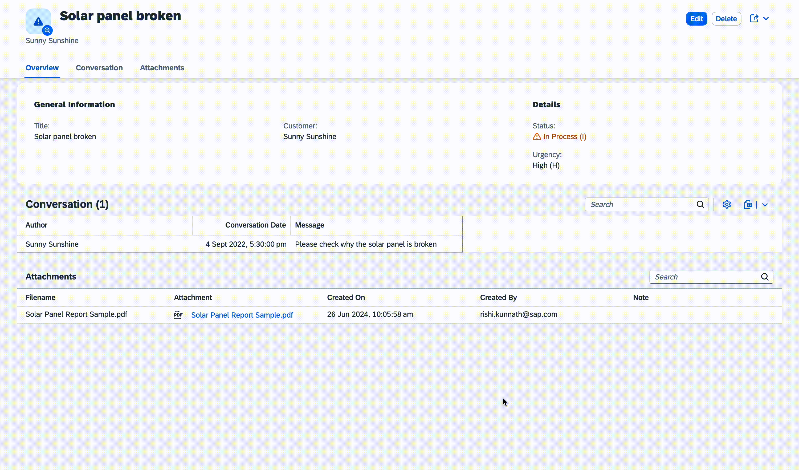

[](https://api.reuse.software/info/github.com/cap-js/sdm)

# CAP plugin for SAP Document Management Service

The **@cap-js/sdm** package is [cds-plugin](https://cap.cloud.sap/docs/node.js/cds-plugins#cds-plugin-packages) that provides an easy CAP-level integration with [SAP Document Management Service](https://discovery-center.cloud.sap/serviceCatalog/document-management-service-integration-option). This package supports handling of attachments(documents) by using an aspect Attachments in SAP Document Management Service.  
This plugin can be consumed by the CAP application deployed on BTP to store their documents in the form of attachments in Document Management Repository.

# Key features

- Create attachment : Provides the capability to upload new attachments.
- Open attachment : Provides the capability to preview attachments.
- Delete attachment : Provides the capability to remove attachments.
- Rename attachment : Provides the capability to rename attachments.
- Virus scanning : Provides the capability to support virus scan for virus scan enabled repositories.
- Draft functionality : Provides the capability of working with draft attachments.
- Display attachments specific to repository: Lists attachments contained in the repository that is configured with the CAP application.
- Custom properties in attachments : Provides the capability to define custom properties for attachments in SDM.
- Link as attachments: Provides the capability to support link or URL as attachments.
- Edit Link-type attachments: Provides the capability to update URL of link-type attachments.

### Table of Contents

- [Pre-Requisites](#pre-requisites)
- [Setup](#setup)
- [Use @cap-js/sdm plugin](#use-cap-jssdm-plugin)
- [Support for Custom Properties](#support-for-custom-properties)
- [Support for Link type attachments](#support-for-link-type-attachments)
- [Support for Edit of Link type attachments](#support-for-edit-of-link-type-attachments)
- [Support for Multitenancy](#support-for-multitenancy)
- [Deploying and testing the application](#deploying-and-testing-the-application)
- [Running the unit tests](#running-the-unit-tests)
- [Known Restrictions](#known-restrictions)
- [Support, Feedback, Contributing](#support-feedback-contributing)
- [Code of Conduct](#code-of-conduct)
- [Licensing](#licensing)

## Pre-Requisites
* Node.JS 16 or higher
* CAP Development Kit (`npm install -g @sap/cds-dk`)
* SAP Build WorkZone should be subscribed to view the HTML5Applications.
* [MTAR builder](https://www.npmjs.com/package/mbt) (`npm install -g mbt`)
* [Cloud Foundry CLI](https://docs.cloudfoundry.org/cf-cli/install-go-cli.html), Install cf-cli and run command `cf install-plugin multiapps`.

## Setup

In this guide, we use the [Incidents Management reference sample app](https://github.com/cap-js/incidents-app) as the base application, to integrate SDM CAP plugin.

> [!Note]
> To be able to use the Fiori *uploadTable* feature, you must ensure 1.121.0/ 1.122.0/ ^1.125.0 SAPUI5 version is updated in the application's _index.html_

### Using the released version
If you want to use the released version of SDM CAP plugin follow the below steps:

1. Clone the incidents-app repository:

```sh
   git clone https://github.com/cap-js/incidents-app.git
```

2. Navigate to incidents-app root folder and checkout to the branch **incidents-app-deploy**:

```sh
   git checkout incidents-app-deploy
```

3. Install SDM CAP plugin by executing the following command:

```sh
   npm add @cap-js/sdm
```

### Using the development version
If you want to use the version under development follow the below steps:

1. Clone the sdm repository:

```sh
   git clone https://github.com/cap-js/sdm.git
```

2. Open terminal, navigate to sdm root folder and generate tarball:

```sh
   npm pack

   This will generate a file with name cap-js-sdm-x.y.z.tgz
```

3. Clone the incidents-app repository:

```sh
   git clone https://github.com/cap-js/incidents-app.git
```

4. Navigate to incidents-app root folder and checkout to the branch **incidents-app-deploy**:

```sh
   git checkout incidents-app-deploy
```

5. Copy the path of .tgz file generated in step 2 and in terminal navigate to incidents-app root folder and execute:

```sh
   npm install <path-to-.tgz file>
```

## Use @cap-js/sdm plugin

**To use sdm plugin in incidents-app, create an element with an `Attachments` type.** Following the [best practice of separation of concerns](https://cap.cloud.sap/docs/guides/domain-modeling#separation-of-concerns), create a separate file _db/attachments.cds_ and paste the below content in it:

```
using { sap.capire.incidents as my } from './schema';
using { Attachments } from '@cap-js/sdm';

extend my.Incidents with { attachments: Composition of many Attachments }
```

Create a SAP Document Management Integration Option [Service instance and key](https://help.sap.com/docs/document-management-service/sap-document-management-service/creating-service-instance-and-service-key). Using credentials from key [onboard a repository](https://help.sap.com/docs/document-management-service/sap-document-management-service/onboarding-repository). Configure the [REPOSITORY_ID](https://github.com/cap-js/incidents-app/blob/9327f550cde9f9666a1ffb3cbc727295b8d6fdb7/mta.yaml#L19) with the repository you want to use for deploying the application. Set the SDM instance name to match the SAP Document Management integration option instance you created in BTP and update this in the mta.yaml file under the  [srv module](https://github.com/cap-js/incidents-app/blob/9327f550cde9f9666a1ffb3cbc727295b8d6fdb7/mta.yaml#L13) and the [resources section](https://github.com/cap-js/incidents-app/blob/9327f550cde9f9666a1ffb3cbc727295b8d6fdb7/mta.yaml#L134) values in the mta.yaml. Currently only non versioned repositories are supported.

## Support for Custom Properties

Custom properties are supported via the usage of CMIS secondary type properties. Follow the below steps to add and use custom properties.

1. If the repository does not contain secondary types and properties, create CMIS secondary types and properties using the [Create Secondary Type API](https://api.sap.com/api/CreateSecondaryTypeApi/overview). The property definition must contain the following section for the CAP plugin to process the property.

   ```json
   "mcm:miscellaneous": {        
      "isPartOfTable": "true"  
   } 
   ```

   With this, the secondary type and properties definition will be as per the sample given below

      ```json
      {
         "id": "Working:DocumentInfo",
         "displayName": "Document Info",
         "baseId": "cmis:secondary",
         "parentId": "cmis:secondary",
         ...
         "propertyDefinitions": {
            "Working:DocumentInfoRecord": {
                  "id": "Working:DocumentInfoRecord",
                  "displayName": "Document Info Record",
                  ...
                  "mcm:miscellaneous": {     <-- Required section in the property definition
                     "isPartOfTable": "true"
                  }
            }
         }
      }
      ```

2. Using secondary properties in CAP Application.
   - Extend the `Attachments` aspect with the secondary properties in the previously created _db/attachments.cds_ file. 
   - Annotate the secondary properties with `@SDM.Attachments.AdditionalProperty.name`. 
   - In this field set the name of the secondary property in SDM. 
   
   Refer the following example from a sample Incidents Management app:

      ```cds
      extend Attachments with {
         customProperty : String
            @SDM.Attachments.AdditionalProperty: {
               name: 'Working:DocumentInfoRecordString'
            }  
            @(title: 'DocumentInfoRecordString');
      }
      ```

   > **Note**
   >
   > SDM supports secondary properties with data types `String`, `Boolean`, `Decimal`, `Integer` and `DateTime`.

## Support for link type attachments

> **Note:** Row-press is the new recommended approach for handling actions on attachment rows. With row-press enabled, the Attachments column will no longer appear as a separate action button. Instead, clicking on a row will automatically perform the appropriate action — opening a link or downloading a file, based on the attachment type.

This plugin provides the capability to create, open, rename and delete attachments of link type.

### Steps to Enable Row-Press for Open Link

1. **Add the `openAttachment` action to application's service definition**
   
   See this [example](https://github.com/cap-js/incidents-app/blob/2126273e16e8a7d5efa18e06de12e06bade8adb5/srv/service.cds#L19) from a sample incidents-management app.

   ```cds
   action openAttachment() returns String;
   ```

2. **Add a custom controller extension** 

   In webapp/controller/custom.controller.js, copy and paste below content.
   
   See this [example](https://github.com/cap-js/incidents-app/blob/sdmIncidents/app/incidents/webapp/controller/custom.controller.js) from a sample incidents-management app.
   
   ```js
   sap.ui.define(
      [
      "sap/ui/core/mvc/ControllerExtension",
      "sap/m/library"
      ], 
      function (ControllerExtension,library) {
         "use strict";
    
         return ControllerExtension.extend("ns.incidents.controller.custom", {
            onRowPress: function(oContext) {
               this.base.editFlow
               .invokeAction("ProcessorService.openAttachment", {
                  contexts: oContext.getParameter("bindingContext")
               })
               .then(function (res) {
                  let odataurl = "";
                  if(res.getObject().value == "None") {
                     const lastSlashIndex = res.oModel.getServiceUrl().lastIndexOf('/');
                     let str = res.oModel.getServiceUrl();
                     if (lastSlashIndex !== -1) {
                        str = str.substring(0, lastSlashIndex)  + str.substring(lastSlashIndex + 1);
                     }
                     odataurl = str+res.oBinding.oContext.sPath+"/content";
                  } else {
                     odataurl = res.getObject().value;
                  }
                  library.URLHelper.redirect(odataurl, true);              
               });
            }
        });
      }
   ); 
   ```
   
   - Replace `ns.incidents` in `ControllerExtension.extend` with the `id` in `manifest.json` file or `id` in `component.js` file. See this [example](https://github.com/cap-js/incidents-app/blob/2126273e16e8a7d5efa18e06de12e06bade8adb5/app/incidents/webapp/manifest.json#L4).
   - Replace `ProcessorService` in `invokeAction("ProcessorService.openAttachment")` with the name of your service.

3. **Add controlConfiguration for Row Press**

   In your `sap.ui5.routing.targets` section, under the relevant Object Page (e.g., `IncidentsObjectPage`), add or extend the `controlConfiguration` for the facet you want to enhance by copy and pasting below content. See this [example](https://github.com/cap-js/incidents-app/blob/2126273e16e8a7d5efa18e06de12e06bade8adb5/app/incidents/webapp/manifest.json#L158).

   ```json
   "controlConfiguration": {
      "attachments/@com.sap.vocabularies.UI.v1.LineItem": {
         "tableSettings": {
            "type": "ResponsiveTable",
            "selectionMode": "Auto",
            "rowPress": ".extension.ns.incidents.controller.custom.onRowPress"
         }
      }
   }
   ```
   - Replace `attachments` with your entity’s facet name as needed.
   - Replace `ns.incidents` in `"rowPress": ".extension.ns.incidents.controller.custom.onRowPress"` with the `id` in `manifest.json` file. Refer this [example](https://github.com/cap-js/incidents-app/blob/2126273e16e8a7d5efa18e06de12e06bade8adb5/app/incidents/webapp/manifest.json#L4) from a sample incidents-management app.

4. **Register the Custom Controller Extension**
   
   In the root of your `sap.ui5` section, add or extend the `extends` property to register your custom controller by copy and pasting below content. See this [example](https://github.com/cap-js/incidents-app/blob/2126273e16e8a7d5efa18e06de12e06bade8adb5/app/incidents/webapp/manifest.json#L191).

   ```json
   "extends": {
      "extensions": {
         "sap.ui.controllerExtensions": {
            "sap.fe.templates.ObjectPage.ObjectPageController#ns.incidents::IncidentsObjectPage": {
               "controllerName": "ns.incidents.controller.custom"
            }
         }
      }
   }
   ```
   - Replace `ns.incidents` in `"sap.fe.templates.ObjectPage.ObjectPageController#ns.incidents::IncidentsObjectPage"` with the `id` in `manifest.json` file. Refer this [example](https://github.com/cap-js/incidents-app/blob/2126273e16e8a7d5efa18e06de12e06bade8adb5/app/incidents/webapp/manifest.json#L4) from a sample incidents-management app.
   - Replace `IncidentsObjectPage` in `"sap.fe.templates.ObjectPage.ObjectPageController#ns.incidents::IncidentsObjectPage"` with id of the relevant Object Page (e.g., IncidentsObjectPage). Refer this [example](https://github.com/cap-js/incidents-app/blob/2126273e16e8a7d5efa18e06de12e06bade8adb5/app/incidents/webapp/manifest.json#L145) from a sample incidents-management app.
   - Replace `ns.incidents` in `"controllerName": "ns.incidents.controller.custom"`with the `id` in `manifest.json` file. Refer this [example](https://github.com/cap-js/incidents-app/blob/2126273e16e8a7d5efa18e06de12e06bade8adb5/app/incidents/webapp/manifest.json#L4) from a sample incidents-management app.
## Support for edit of link type attachments

This plugin provides the capability to update/edit the URL of attachments of link type.

### Steps to Enable Edit Link Feature in CAP Application

1. **Add the `editLink` action to application's service definition**

   See this [example](https://github.com/cap-js/incidents-app/blob/sdmIncidents/srv/service.cds#L19) from a sample incidents-app:

   ```cds
   action editLink(
         @mandatory @assert.format:'^(https?:\/\/)(([a-zA-Z0-9\-]+\.)+[a-zA-Z]{2,}|localhost)(:\d{2,5})?(\/[^\s]*)?$'
         @Common.Label:'URL' url: String @UI.Placeholder: 'Example: https://www.example.com'
      ); 
   ```
    - Purpose: Enables users to edit URL of previously created links.
    - Validation: Ensures only valid HTTP(S) URLs are accepted.
    - UI Support: Provides labels and placeholders for better user experience.

### UI Annotation Setup

To enable the editing of links, you need to add a new button to the attachments table toolbar. This button will appear as an **inline button labeled "Edit Link"** on the attachment row of the attachments table for only link type attachments. When clicked, it will display a menu with the **"Edit Link"** option, allowing users to edit the URL of an existing link-type attachment.

Add the following annotation block to your app/incidents/annotations.cds file. See this [example](https://github.com/cap-js/incidents-app/blob/sdmIncidents/app/incidents/annotations.cds#L215)

```cds
annotate service.Incidents.attachments with @UI: {
  HeaderInfo: {
        $Type         : 'UI.HeaderInfoType',
        TypeName      : '{i18n>Attachment}',
        TypeNamePlural: '{i18n>Attachments}',
  },
  LineItem  : [
    {Value: type, @HTML5.CssDefaults: {width: '10%'}},
    {Value: filename, @HTML5.CssDefaults: {width: '25%'}},
    {Value: content, @HTML5.CssDefaults: {width: '0%'}},
    {Value: createdAt, @HTML5.CssDefaults: {width: '20%'}},
    {Value: createdBy, @HTML5.CssDefaults: {width: '20%'}},
    {Value: note, @HTML5.CssDefaults: {width: '25%'}},
    {
      $Type  : 'UI.DataFieldForActionGroup',
      ID     : 'TableActionGroup',
      Label  : 'Create',
      ![@UI.Hidden]: {$edmJson: {$Eq: [ {$Path: 'IsActiveEntity'}, true ]}},
      Actions: [
        {
          $Type : 'UI.DataFieldForAction',
          Label : 'Link',
          Action: 'ProcessorService.createLink',
        }
      ]
    },
    {
      @UI.Hidden: {$edmJson:{$If:[{$Eq:[{$Path: 'IsActiveEntity' },true]},true,{$If:[{$Ne:[{$Path:'mimeType'},'application/internet-shortcut']},true,false]}]}},
      $Type : 'UI.DataFieldForAction',
      Label : 'Edit Link',
      Action: 'ProcessorService.editLink', // -> Ensure the service name is correct
      Inline: true,
      IconUrl: 'sap-icon://edit',
      @HTML5.CssDefaults: {width: '4%'}
    }
  ]
}
{
  url @readonly;
  note @(title: '{i18n>Note}');
  filename @(title: '{i18n>Filename}');
  modifiedAt @(odata.etag: null);
  content
      @Core.ContentDisposition: { Filename: filename, Type: 'inline' }
      @(title: '{i18n>Attachment}');
  folderId @UI.Hidden;
  mimeType @UI.Hidden;
  status @UI.Hidden;
  repositoryId @UI.Hidden;
}

annotate service.Incidents.attachments with {
  customProperty1 @Common.ValueListWithFixedValues;
}
```

- Ensure `service.Incidents.attachments` is the correct path for your entity and its attachments element where you have defined `composition of many Attachments`.
- Ensure ProcessorService in Action: `ProcessorService.editLink` is the name of your service.
- Repeat this annotation for other entities if you have defined `composition of many Attachments` in multiple places.


## Known Restrictions

### Steps to Enable Create Link Feature in CAP Application

> **Note:** Enabling row-press for open link (see steps above) is a prerequisite for link support.

1. **Add the `createLink` action to application's service definition** 
   
   See this [example](https://github.com/cap-js/incidents-app/blob/2126273e16e8a7d5efa18e06de12e06bade8adb5/srv/service.cds#L14) from a sample incidents-management app:

   ```cds
   entity Incidents.attachments as projection on my.Incidents.attachments
   actions {
      @(Common.SideEffects : {TargetEntities: ['']},)
      action createLink(
         in:many $self,
         @mandatory @Common.Label:'Name' name: String @UI.Placeholder: 'Enter a name for the link',
         @mandatory @assert.format:'^(https?:\/\/)(([a-zA-Z0-9\-]+\.)+[a-zA-Z]{2,}|localhost)(:\d{2,5})?(\/[^\s]*)?$'
         @Common.Label:'URL' url: String @UI.Placeholder: 'Example: https://www.example.com'
      );
   }
   ```
   - Purpose: Enables users to create links with name and URL.
   - Validation: Ensures only valid HTTP(S) URLs are accepted.
   - UI Support: Provides labels and placeholders for better user experience.

### UI Annotation Setup

To enable the creation of links, you need to add a new button to the attachments table toolbar. This button will appear as a **menu button labeled "Create"** on the toolbar of the attachments table. When clicked, it will display a menu with the **"Link"** option, allowing users to create a new link-type attachment.

Add the following annotation block to your `app/<entity-folder>/<annotation-file>.cds` file. See this [example](https://github.com/cap-js/incidents-app/blob/2126273e16e8a7d5efa18e06de12e06bade8adb5/app/incidents/annotations.cds#L188).

```cds
annotate service.Incidents.attachments with @UI: {
  HeaderInfo: {
        $Type         : 'UI.HeaderInfoType',
        TypeName      : '{i18n>Attachment}',
        TypeNamePlural: '{i18n>Attachments}',
  },
  LineItem  : [
    {Value: type, @HTML5.CssDefaults: {width: '10%'}},
    {Value: filename, @HTML5.CssDefaults: {width: '25%'}},
    {Value: content, @HTML5.CssDefaults: {width: '0%'}},
    {Value: createdAt, @HTML5.CssDefaults: {width: '20%'}},
    {Value: createdBy, @HTML5.CssDefaults: {width: '20%'}},
    {Value: note, @HTML5.CssDefaults: {width: '25%'}},
    {
      $Type  : 'UI.DataFieldForActionGroup',
      ID     : 'TableActionGroup',
      Label  : 'Create',
      ![@UI.Hidden]: {$edmJson: {$Eq: [ {$Path: 'IsActiveEntity'}, true ]}},
      Actions: [
        {
          $Type : 'UI.DataFieldForAction',
          Label : 'Link',
          Action: 'ProcessorService.createLink',
        }
      ]
    },
  ]
}
{
  url @readonly;
  note @(title: '{i18n>Note}');
  filename @(title: '{i18n>Filename}');
  modifiedAt @(odata.etag: null);
  content
      @Core.ContentDisposition: { Filename: filename, Type: 'inline' }
      @(title: '{i18n>Attachment}');
  folderId @UI.Hidden;
  mimeType @UI.Hidden;
  status @UI.Hidden;
  repositoryId @UI.Hidden;
}
```

- Replace `service.Incidents.attachments` with the correct path for your entity and element (for example, `my.YourEntity.yourElement`) where you have defined `composition of many Attachments`.
- Replace `ProcessorService` in `Action: 'ProcessorService.createLink'` with the name of your service.

### Updating Tenant Databases for Link Feature
To support the Link feature, additional database columns are introduced.
Upon re-deployment of your multitenant application, you may encounter "invalid column" errors if tenant database containers are not updated.

To resolve this, ensure the following task is added to the mta.yaml for the sidecar application.
```yaml
tasks:
   -  name: upgrade-db
      command: cds-mtx upgrade '*'
```
This will automatically update tenant databases during deployment.

## Support for Multitenancy

This plugin automates repository lifecycle management in a multi-tenant setup. On tenant subscription, it provisions a repository and stores its details, and on unsubscription, it securely cleans up the repository.

Refer the following example from a sample Incidents Management app which demonstrates how to onboard a new repository for a subscribing tenant.

1. Add the cds.xt.DeploymentService to the package.json file

    ```json
   "cds": {
    "requires": {
        "cds.xt.DeploymentService": {
            "preset": "in-sidecar"
         }
      }
    }
    ```
2. Add the @cap-js/sdm dependency to the mtx/sidecar/package.json

3. Add the external id of repository in properties of incidents-mtx-mtx in mta.yaml

4. Add SDMRepositoryConfig.js file in mtx/sidecar folder with the following content:

    ```js
    module.exports = {
        sdm: {
            repositoryConfig: {
            displayName: "SDM Repository",
            description: "Onboarded on tenant subscription",
            repositoryType: "internal",
            isVersionEnabled: "false",
            isVirusScanEnabled: "false",
            skipVirusScanForLargeFile: "true",
            hashAlgorithms: "SHA-256"
            }
        }
    };
    ```

When the application is deployed as a SaaS application with above code, a repository is onboarded automatically when a tenant subscribes the SaaS application. The same repository is deleted when the tenant unsubscribes from the SaaS application. The necessary params for the Repository onboarding can be found in the [documentation](https://help.sap.com/docs/document-management-service/sap-document-management-service/internal-repository).

## Deploying and testing the application

1. Log in to Cloud Foundry space:

   ```sh
   cf login -a <CF-API> -o <ORG-NAME> -s <SPACE-NAME>
   ```

2. Bind CAP application to SAP Document Management Integration Option. Check the following reference from `mta.yaml` of Incidents Management app

   ```
   modules:
      - name: incidents-srv
      type: nodejs
      path: gen/srv
      requires:
         - name: sdm-di-instance
  
   resources:
      - name: sdm-di-instance
      type: org.cloudfoundry.managed-service
      parameters:
         service: sdm
         service-plan: standard
   ```

3. Build the project by running following command from root folder of incidents-app.
   ```sh
   mbt build
   ```
   Above step will generate .mtar file inside mta_archives folder.

4. Deploy the application
   ```sh
   cf deploy mta_archives/*.mtar
   ```

5. Launch the application
   ```sh
   * Navigate to Html5Applications menu in BTP subaccount and open the application (nsincidents v1.0.0) in a browser.
   * Click on incident with title Solar panel broken.
   ```  

6. The `Attachments` type has generated an out-of-the-box Attachments table (see highlighted box) at the bottom of the Object page:
   

7. **Upload a file** by going into Edit mode and either using the **Upload** button on the Attachments table or by drag/drop. The file is then stored in SAP Document Management Integration Option. We demonstrate this by uploading the PDF file from [_xmpl/db/content/Solar Panel Report.pdf_](./xmpl/db/content/Solar%20Panel%20Report.pdf):
   

8. **Open a file** by clicking on the attachment. We demonstrate this by opening the previously uploaded PDF file: `Solar Panel Report.pdf`
   

9. **Rename a file** by going into Edit mode and setting a new name for the file in the filename field. Then click the **Save** button to have that file renamed in SAP Document Management Integration Option. We demonstrate this by renaming the previously uploaded PDF file: `Solar Panel Report.pdf`
   

10. **Delete a file** by going into Edit mode and selecting the file(s) and by using the **Delete** button on the Attachments table. Then click the **Save** button to have that file deleted from the resource (SAP Document Management Integration Option). We demonstrate this by deleting the previously uploaded PDF file: `Solar Panel Report_2024.pdf`
   

## Running the unit tests

To run the unit tests:
```sh
npm run test
```

## Known Restrictions

- Repository : This plugin does not support the use of versioned repositories.
- File size : Attachments are limited to a maximum size of 100 MB.

## Support, Feedback, Contributing

This project is open to feature requests/suggestions, bug reports etc. via [GitHub issues](https://github.com/cap-js/sdm/issues). Contribution and feedback are encouraged and always welcome. For more information about how to contribute, the project structure, as well as additional contribution information, see our [Contribution Guidelines](CONTRIBUTING.md).

## Code of Conduct

We as members, contributors, and leaders pledge to make participation in our community a harassment-free experience for everyone. By participating in this project, you agree to abide by its [Code of Conduct](CODE_OF_CONDUCT.md) at all times.

## Licensing

Copyright 2024 SAP SE or an SAP affiliate company and <your-project> contributors. Please see our [LICENSE](LICENSE) for copyright and license information. Detailed information including third-party components and their licensing/copyright information is available [via the REUSE tool](https://api.reuse.software/info/github.com/cap-js/sdm).
